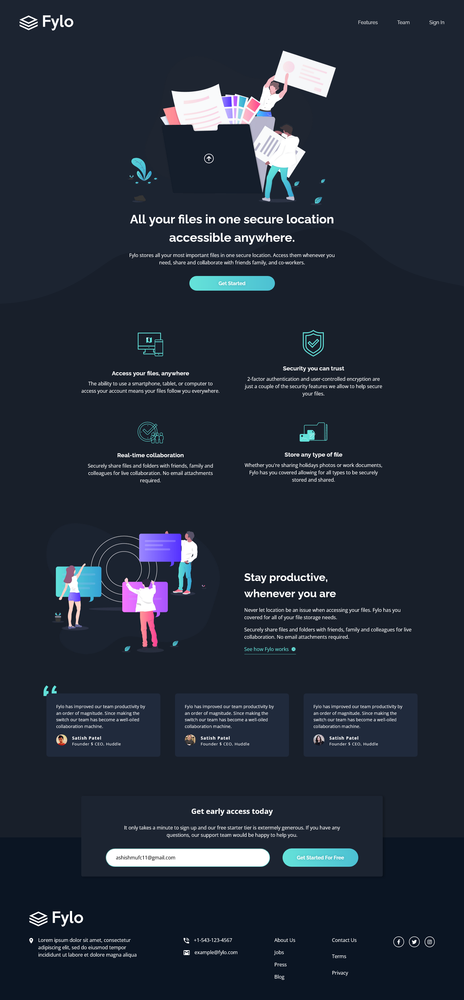

# Frontend Mentor - Fylo dark theme landing page solution

This is a solution to the [Fylo dark theme landing page challenge on Frontend Mentor](https://www.frontendmentor.io/challenges/fylo-dark-theme-landing-page-5ca5f2d21e82137ec91a50fd). Frontend Mentor challenges help you improve your coding skills by building realistic projects.

## Table of contents

- [Overview](#overview)
  - [The challenge](#the-challenge)
  - [Screenshot](#screenshot)
- [My process](#my-process)
  - [Built with](#built-with)
  - [What I learned](#what-i-learned)
- [Author](#author)

## Overview

### The challenge

Users should be able to:

- View the optimal layout for the site depending on their device's screen size
- See hover states for all interactive elements on the page

### Screenshot




### Links

- Solution URL: [Add solution URL here](https://your-solution-url.com)
- Live Site URL: [Add live site URL here](https://your-live-site-url.com)

## My process

### Built with

- Semantic HTML5 markup
- CSS custom properties
- Flexbox
- CSS Grid
- Mobile-first workflow

### What I learned

In this project I have learned about ARIA and to make web content more accessible to the people with disabilities. I have implemented a skip to content button for those wanting to skip to the main content on the website. Further more I have learned to make use of resets, utility classes and custom properties.

To see how you can add code snippets, see below:

```html
<a href="#main" class="skip-to-content text-accent">Skip to content</a>
```

```css
.skip-to-content {
  position: absolute;
  z-index: 9999;
  background: hsl(var(--clr-white));
  color: hsl(var(--clr-dark));
  padding: 0.5em 1em;
  margin-inline: auto;
  transform: translateY(-100%);
  transition: transform 250ms ease-in;
}

.skip-to-content:focus {
  transform: translateY(0);
}
```

## Author

- Website - [Ashish Shrestha](https://ashishshresth.github.io/)
- Frontend Mentor - [@AshishShresth](https://www.frontendmentor.io/profile/AshishShresth)
